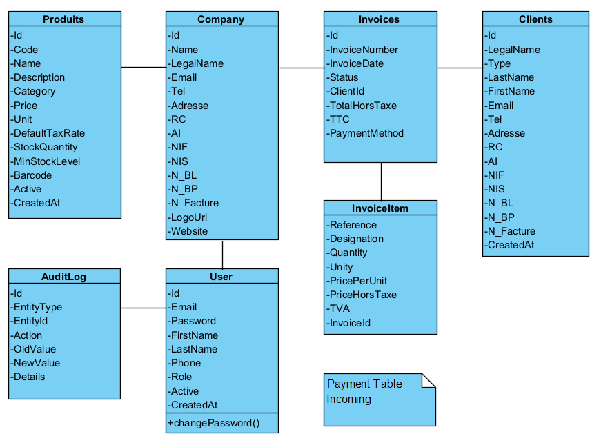

# Invoicing Automation

This project is designed to automate and manage the invoicing workflow for companies and independent professionals.

The system focuses on invoice creation, client management, payment tracking, and operational traceability, with an emphasis on clean domain modeling and business-driven design.

---

## Core Features

### Invoice Management
- Create and manage invoices with multiple line items
- Automatic calculation of totals (HT, TVA, TTC)
- Invoice lifecycle handling (draft, issued, paid, overdue)
- Support for multiple payment methods

### Clients & Companies
- Manage clients (individuals or companies)
- Company profile configuration (legal information, identifiers, branding)
- Client and company linkage to invoices

### Products & Services
- Product catalog with pricing, tax rates, and stock information
- Reusable products across invoices
- Stock level tracking and alerts

### Automation & Monitoring
- Scheduled reminders for due and overdue invoices
- Incoming payment tracking
- Audit logging of critical actions (creation, updates, status changes)

---

## Architecture Overview

The application follows a layered architecture:

- **Controllers**: HTTP API endpoints
- **Services**: Business logic and workflow orchestration
- **Models**: Core entities (Invoice, Client, Product, Company, etc.)
- **Data**: Entity Framework Core with PostgreSQL

UML diagrams are used to model entity relationships, invoice composition, and business responsibilities.

 

---

## Technical Stack

- ASP.NET Core (Web API)
- Entity Framework Core
- PostgreSQL
- MVC architecture principles
- UML-driven domain modeling

---

## Project Status

# Ongoing development  
Planned features include notification systems, payment reconciliation, reporting dashboards, and role-based access control.
